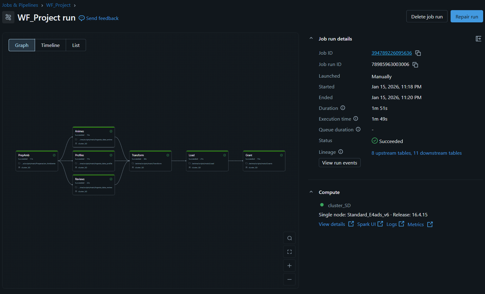

<div align="center">

# 🎌 Anime Analytics ETL Pipeline
### Arquitectura Medallion en Azure Databricks

[](https://databricks.com/)
[](https://azure.microsoft.com/)
[](https://spark.apache.org/)
[](https://delta.io/)
[](https://github.com/features/actions)

*Pipeline de ingeniería de datos para análisis de animes, reviews y comportamiento de usuarios usando arquitectura Medallion con control de accesos y despliegue continuo*

</div>

---

## 🎯 Descripción

Proyecto de **Ingeniería de Datos** que implementa un **pipeline ETL end-to-end** sobre datos de Anime obtenidos desde **Kaggle (MyAnimeList)**.  
El proyecto utiliza **Arquitectura Medallion (Bronze–Silver–Gold)** en **Azure Databricks**, con **Delta Lake**, **Unity Catalog**, **CI/CD con GitHub Actions** y **gobernanza de datos mediante GRANTS y REVOKE**.

El objetivo es entregar **datasets analytics-ready** para análisis de popularidad, engagement de usuarios y tendencias por género.

---

## ✨ Características Principales

- 🔄 **ETL Automatizado** con PySpark
- 🏗️ **Arquitectura Medallion** (Bronze, Silver, Gold)
- 📦 **Normalización de datos** (arrays, JSON, fechas)
- 🔐 **Data Governance** con GRANTS y REVOKE
- 🚀 **CI/CD** usando GitHub Actions
- ⚡ **Delta Lake** (ACID, schema enforcement)
- 📊 **Tablas Gold listas para BI / SQL Analytics**
- 🧪 Validaciones e integridad referencial

---

## 🏛️ Arquitectura

### Flujo de Datos

```
📄 CSV (Raw Data)
    ↓
🥉 Bronze Layer (Ingesta sin transformación)
    ↓
🥈 Silver Layer (Limpieza + Modelo Dimensional)
    ↓
🥇 Gold Layer (Agregaciones de Negocio)
    ↓
📊 Databricks Dashboards (Visualización)
```


---

## 📦 Capas del Pipeline

<table>
<tr>
<td width="33%" valign="top">

### 🥉 Bronze Layer
**Propósito**: Ingesta sin transformación

**Tablas**:
- `animes`
- `reviews`
- `profiles`

**Características**:
- Datos tal como vienen de Kaggle
- `ingestion_date`
- Sin validaciones
- Acceso restringido

</td>
<td width="33%" valign="top">

### 🥈 Silver Layer
**Propósito**: Limpieza y modelado

**Tablas**:
- `animes_transformed`
- `animes_genres`
- `profiles_transformed`
- `animes_favorites_users`
- `reviews_transformed`

**Características**:
- Deduplificación
- Tipado de datos
- Parsing de fechas (`aired`, `birthday`)
- Explode de arrays
- JSON a columnas
- Integridad referencial

</td>
<td width="33%" valign="top">

### 🥇 Gold Layer
**Propósito**: Analytics-ready

**Tablas**:
- `anime_kpis`
- `genre_trends`
- `user_engagement`

**Características**:
- KPIs pre-agregados
- Optimizado para BI
- Consultas simples
- Alto performance

</td>
</tr>
</table>

---

## 📁 Estructura del Proyecto

```
etl-anime/
│
├── 📂 .github/
│   └── 📂 workflows/
│       └── 📄 deploy-production.yml    # Pipeline CI/CD deploy a certification workspace databricks
├── 📂 process/
│   ├── 🐍 Ingesta_data_anime.py        # Bronze layer
│   ├── 🐍 Ingesta_data_profile.py      # Bronze Layer
│   ├── 🐍 Ingesta_data_review.py       # Bronze Layer
│   ├── 🐍 Transform.py                 # Silver Layer
│   ├── 🐍 Load.py                      # Golden Layer
├── 📂 scrips/
|   ├── 🐍 Preparacion_Ambiente.py      # Create Schema, Tables, External location
├── 📂 security/
|   ├── 🐍 Grants.py                    # Sql Grant
├── 📂 reversion/
|   ├── 🐍 Revoke.py                    # Revoke permissions
├── 📂 dashboards/                      # Databricks Dashboards 
└── 📄 README.md
```

---

## 🛠️ Tecnologías

| Tecnología | Propósito |
|----------|----------|
| Azure Databricks | Procesamiento distribuido |
| Apache Spark (PySpark) | ETL |
| Delta Lake | Storage ACID |
| Unity Catalog | Gobierno de datos |
| GitHub Actions | CI/CD |
| Kaggle | Fuente de datos |

---

## 🔐 Gobierno de Datos (Security)

### Principios aplicados

- Least Privilege
- Separación de responsabilidades
- Protección de Bronze
- Gold como capa de consumo

### Ejemplos

```sql
REVOKE CREATE TABLE ON SCHEMA bronze FROM `data_engineers`;
GRANT SELECT ON ALL TABLES IN SCHEMA gold TO `bi_users`;
GRANT ALL PRIVILEGES ON SCHEMA silver TO `cicd_service`;
```
---
## 🔄 CI/CD

### Pipeline de GitHub Actions

```yaml
Workflow: WF_Project
├── Deploy notebooks → /anime/scripts
├── Eliminar workflow antiguo (si existe)
├── Buscar cluster configurado
├── Crear nuevo workflow con las tareas
├── Ejecutar pipeline automáticamente
└── Monitorear y notificar resultados
```

### 🔄  Workflow Databricks


---

## 📈 Dashboards
https://github.com/WallsPain/CIDCDFinalProject/tree/main/dashboards

## 🔍 Monitoreo

### En Databricks

**Workflows**:
- Ir a **Workflows** en el menú lateral
- Buscar `WF_Project`
- Ver historial de ejecuciones

**Logs por Tarea**:
- Click en una ejecución específica
- Click en cada tarea para ver logs detallados
- Revisar stdout/stderr en caso de errores

### En GitHub Actions

- Tab **Actions** del repositorio
- Ver historial de workflows
- Click en ejecución específica para detalles
- Revisar logs de cada step

---

## 👤 Autor

<div align="center">

### Juan Daniel Vasquez Rengifo
